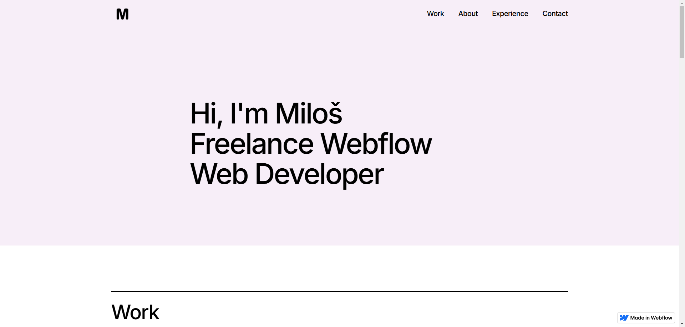
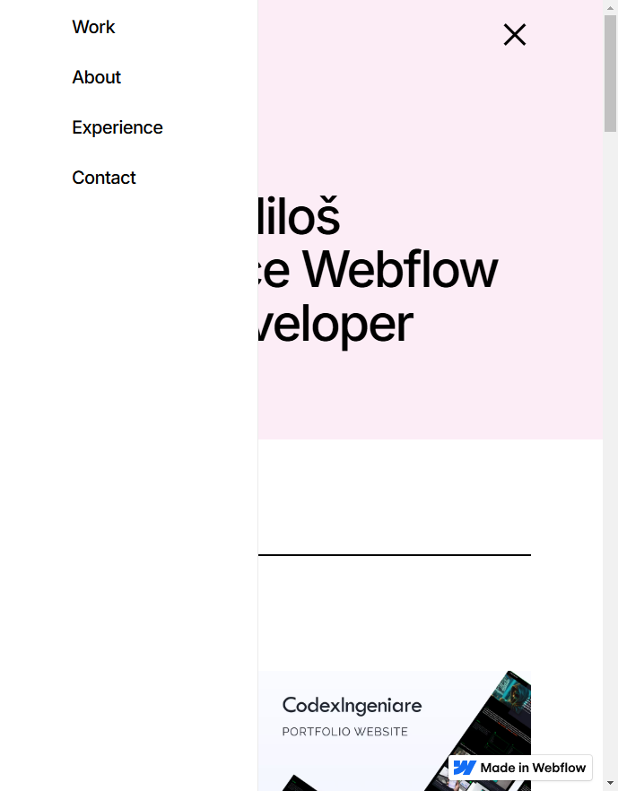
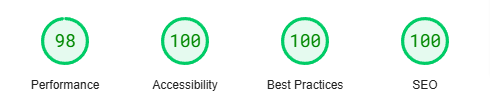

# Miloš Webflow Development Portfolio
Welcome to my personal portfolio showcasing my skills and projects in Webflow development! This website is a digital representation of my expertise, experience, and creative solutions I’ve built using Webflow to craft engaging and responsive websites. I use Webflow to bring designs to life with custom functionality, ensuring each project is optimized for performance and user experience.

 

# Project Overview
This portfolio demonstrates the work I've done using Webflow to create responsive, modern, and visually appealing websites. Each project reflects my ability to design, develop, and launch websites that are user-friendly, responsive, and optimized for performance.

This portfolio is built to:
* Showcase Webflow projects with custom animations, interactions, and responsive designs.
* Provide insights into my web development process, from concept to deployment.
* Demonstrate my ability to create functional and dynamic websites with Webflow’s powerful tools.

 

👉[Explore Portfolio](https://milos-webflow-dev-portfolio.webflow.io/)

## Features 🌟
- Interactive & Responsive Design: The portfolio adapts to different screen sizes, ensuring an optimal experience across desktop, tablet, and mobile devices.
- Webflow Animations & Interactions: Smooth transitions, hover effects, and interactions that engage users and enhance the experience.
- Portfolio Showcase: A variety of Webflow projects with details on the design process, key features, and custom interactions.
- Clean Layout: A simple, minimalistic design that focuses on showcasing the work and providing a smooth browsing experience.
- Intuitive Navigation: Clear, easy-to-use navigation allowing users to explore different sections of the portfolio effortlessly.

## Technologies Used ⚙️
- **Webflow:** The platform used to design and host the portfolio.
- **HTML/CSS:** Custom code for structure and styling.
- **JavaScript:** Used for some interactive elements to enhance user experience.

## Responsive Design 📱💻
The portfolio utilizes responsive design principles to ensure a seamless experience across various devices:

- **Fluid Grids & Flexible Layouts:** Layouts adjust dynamically for a consistent, optimized viewing experience across all screen sizes.
- **Media Queries:** Custom breakpoints that provide a tailored user experience on desktop, tablet, and mobile devices.

 

## Performance 🚀
The website is optimized to ensure fast loading times and smooth performance:

- Image Optimization: Images are compressed and optimized for fast loading without compromising visual quality.
- Minified Code: CSS and JavaScript files are minified for reduced file sizes and faster load times.
- Lazy Loading: Images and content are loaded only when needed to improve page performance.

## Accessibility ♿
Built with accessibility in mind, the website includes the following features:

- Semantic HTML: Properly structured HTML to ensure screen reader compatibility.
- Keyboard Navigation: Ensures the site can be navigated using a keyboard for - users with mobility impairments.
- Alt Text for Images: All images are equipped with alt text for screen readers.

## SEO (Search Engine Optimization) 📈
SEO practices have been incorporated to help the site rank better and improve visibility:

- SEO-Friendly URLs & Meta Tags: Ensures that search engines can easily crawl and index the site’s content.
- Optimized Images & Fast Load Times: Both contribute to improving search engine rankings.
- Responsive Design: Mobile-friendliness is a key ranking factor, and the site has been optimized for all devices.

## Website Score 📊
You can measure the performance and SEO effectiveness of the site using tools like:

- Google PageSpeed Insights
- Lighthouse

 

 

# Contact 📬
Feel free to get in touch for inquiries, collaboration opportunities, or feedback.

- Email: milosstankovic2002@gmail.com
- [Connect with me on LinkedIn](https://www.linkedin.com/in/milos-stankovic25/)
